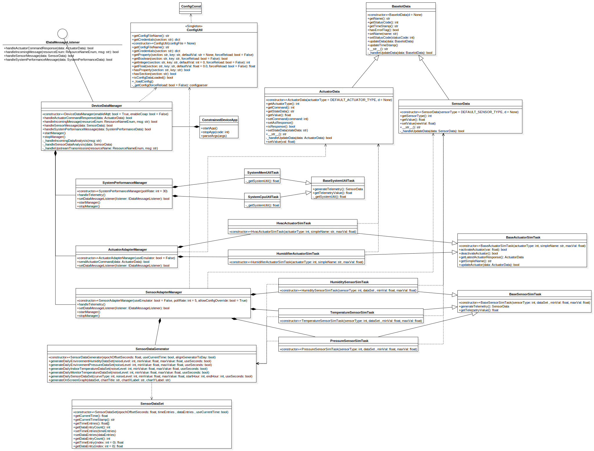

# Constrained Device Application (Connected Devices)

## Lab Module 03

<!-- Be sure to implement all the PIOT-CDA-* issues (requirements) listed at [PIOT-INF-03-001 - Chapter 03](https://github.com/orgs/programming-the-iot/projects/1#column-10488379). -->

### Description

<!-- NOTE: Include two full paragraphs describing your implementation approach by answering the questions listed below. -->

What does your implementation do? 

1. Implement several classes:
   1. Implement many data wrapper for sensor and actuator:
      1. `SensorData`, wrapper of sensor data value and type.
      2. `ActuatorData`, wrapper of actuator command, value and type.
   2. Implement many SimTask classes for simulating getting sensor data from sensor:
      1. `BaseSensorSimTask`, base class implement main features of sim sensor tasks: generate telemetry(`SensorData`).
      2. `HumiditySensorSimTask`, subclass for humidity sensor, set specific configs: sim value range and sensor type.
      3. `PressureSensorSimTask`, subclass for pressure sensor, set specific configs: sim value range and sensor type.
      4. `TemperatureSensorSimTask`, subclass for temperature sensor, set specific configs.
   3. Implement many SimTask classes for simulating sending command to Actuators:
      1. `BaseActuatorSimTask`, base class implement main features of sim sensor tasks: read and run command/`ActuatorData` and response.
      2. `HvacActuatorSimTask`, subclass for humidity sensor, set specific configs: sim value range and actuator type.
      3. `HumidifierActuatorSimTask`, subclass for humidity sensor, set specific configs: sim value range and actuator type.
   4. Implement two AdapterManger classes:
      1. `SensorAdapterManager`, maintain all sensor tasks: trigger tasks and handle received telemetries.
      2. `ActuatorAdapterManager`, maintain all actuator tasks: send commands(`ActuatorData`).
   5. Integrate Data Generator:
      1. Use `SensorDataGenerator` in `SensorAdapterManager` to generate sim dataset for simulation if `useEmulator` is disabled.
   6. Implement `DeviceDataManager`:
      1. Move `SystemPerformanceManager` from `ConstrainedDeviceApp` to here
      2. Manage `SensorAdapterManager` and `ActuatorAdapterManager` here, handle their callbacks:
         1. Analysis their given data(Simple implemented and not complete).
         2. Convert and Upload their given data(Simple implemented and not complete).
      3. Handle incoming data, commands or messages(Simple implemented and not complete).
2. Update CI(GitHub Action) to test all tests in part01 and related tests for Lab 3:
   1. Update [GitHub Action workflow file](../../.github/workflows/python-app.yml).

How does your implementation work?

1. The core is `DeviceDataManager`, it maintain `SensorAdapterManager` and `ActuatorAdapterManager` and handle all callbacks and data:
   1. According to config, `DeviceDataManager` will call other modules to:
      1. Analysis data.
      2. Upload data: Upload telemetry(`SensorData`) from `SensorAdapterManager`.
      3. Run command: Send command(`ActuatorData`) to `ActuatorAdapterManager`.
      4. Handle messages.
2. At current stage, AdapterManagers manage sim tasks:
   1. `SensorAdapterManager` simply maintain sim sensor tasks: `HumiditySensorSimTask`, `PressureSensorSimTask`, `TemperatureSensorSimTask`.
   2. `SensorAdapterManager` use `SensorData` to transmit sensor data with sensors and `DeviceDataManager`.
   3. `ActuatorAdapterManager` simply maintain sim actuator tasks: `HvacActuatorSimTask`, `HumidifierActuatorSimTask`.
   4. `ActuatorAdapterManager` use `ActuatorData` to transmit command and data with actuators and `DeviceDataManager`.
3. Use `SensorDataGenerator` to generate sim dataset:`SensorDataSet` and pass dataset to each sim task.
4. For CI, Github Action now run tests in a better way:
   1. Use GitHub Action integrated command to update `PYTHONPATH` environment variable.
        ```yaml
        echo "PYTHONPATH=${PYTHONPATH}:./:./src/main/python:./src/test/python" >> $GITHUB_ENV
        ```
   2. Always run unit tests first, to avoid some mutilthread file occupy problems.
   3. Update tests to run: include all related tests need to run for lab module 3.

### Code Repository and Branch

<!-- NOTE: Be sure to include the branch (e.g. https://github.com/programming-the-iot/python-components/tree/alpha001). -->

URL: https://github.com/NU-CSYE6530-Fall2020/constrained-device-app-Taowyoo/tree/alpha001

### UML Design Diagram(s)

Here is the [class diagram](../../doc/UML/Lab03.svg) of latest code:


### Unit Tests Executed

- Part01
  - src\test\python\programmingtheiot\part01\unit\common\ConfigUtilTest.py
  - src\test\python\programmingtheiot\part01\unit\system\SystemCpuUtilTaskTest.py
  - src\test\python\programmingtheiot\part01\unit\system\SystemMemUtilTaskTest.py
- Part02
  - src\test\python\programmingtheiot\part02\unit\data\ActuatorDataTest.py
  - src\test\python\programmingtheiot\part02\unit\data\SensorDataTest.py
  - src\test\python\programmingtheiot\part02\unit\data\SystemPerformanceDataTest.py
  - src\test\python\programmingtheiot\part02\unit\sim\HumiditySensorSimTaskTest.py
  - src\test\python\programmingtheiot\part02\unit\sim\PressureSensorSimTaskTest.py
  - src\test\python\programmingtheiot\part02\unit\sim\TemperatureSensorSimTaskTest.py
  - src\test\python\programmingtheiot\part02\unit\sim\HvacActuatorSimTaskTest.py
  - src\test\python\programmingtheiot\part02\unit\sim\HumidifierActuatorSimTaskTest.py

### Integration Tests Executed

- Part01
  - src\test\python\programmingtheiot\part01\integration\app\ConstrainedDeviceAppTest.py
  - src\test\python\programmingtheiot\part01\integration\system\SystemPerformanceManagerTest.py
- Part02
  - src\test\python\programmingtheiot\part02\integration\system\SensorAdapterManagerTest.py
  - src\test\python\programmingtheiot\part02\integration\system\ActuatorAdapterManagerTest.py
  - src\test\python\programmingtheiot\part02\integration\app\DeviceDataManagerNoCommsTest.py
